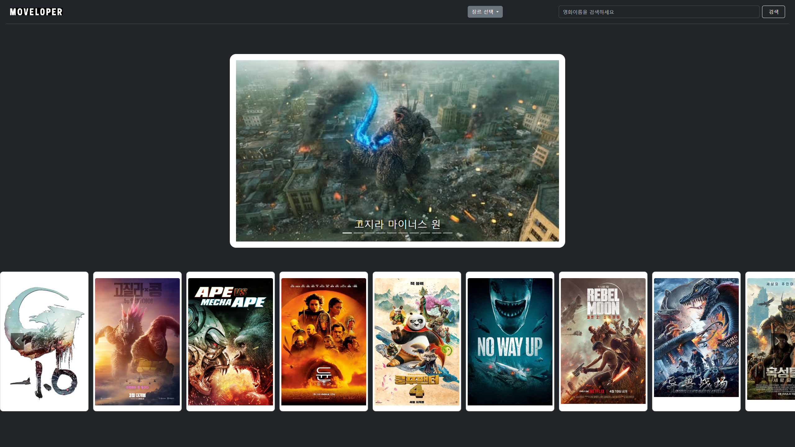
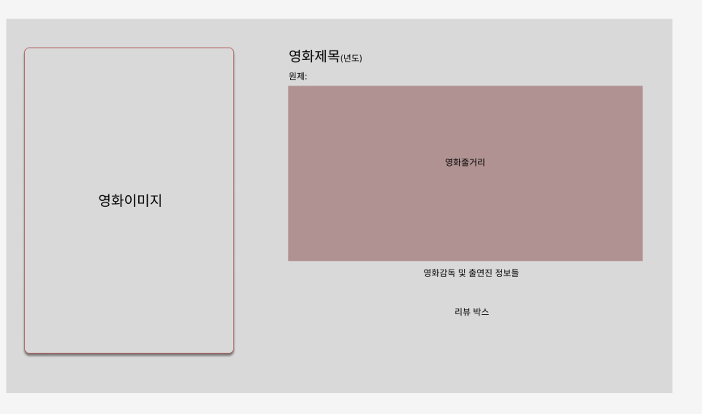
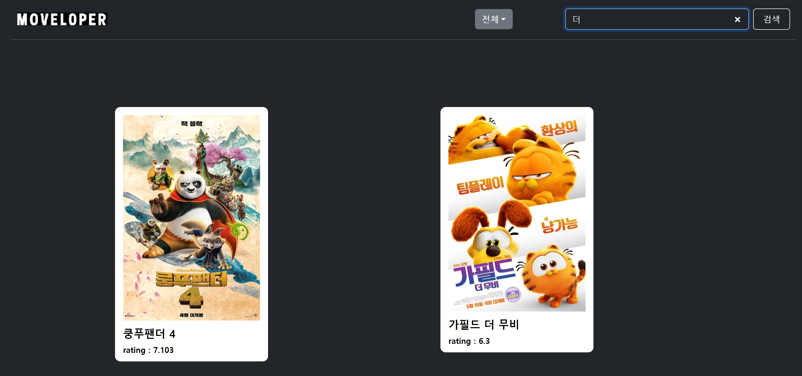
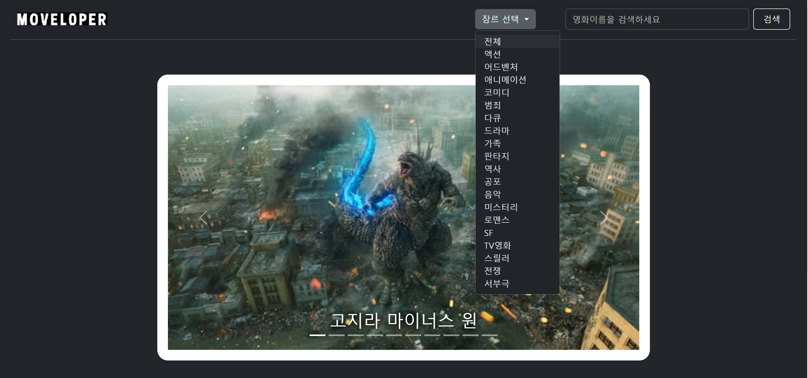
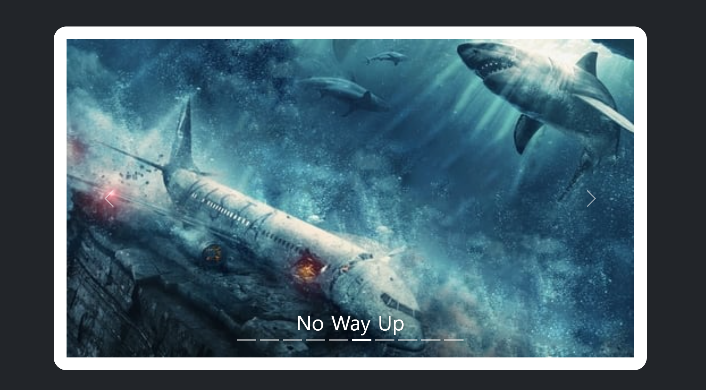
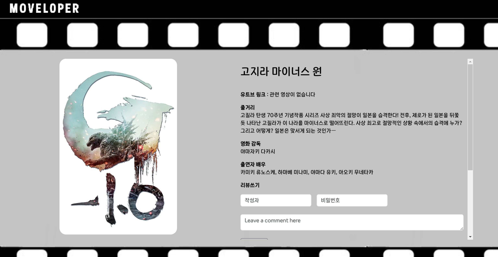
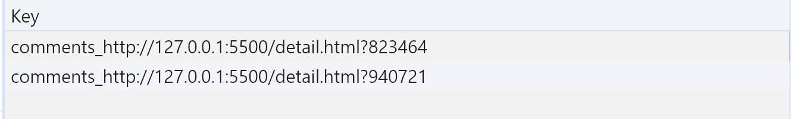
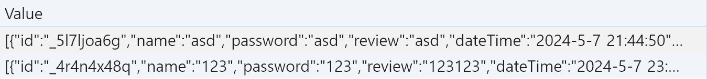
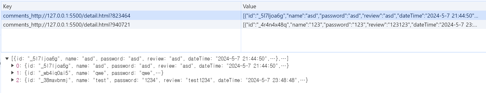
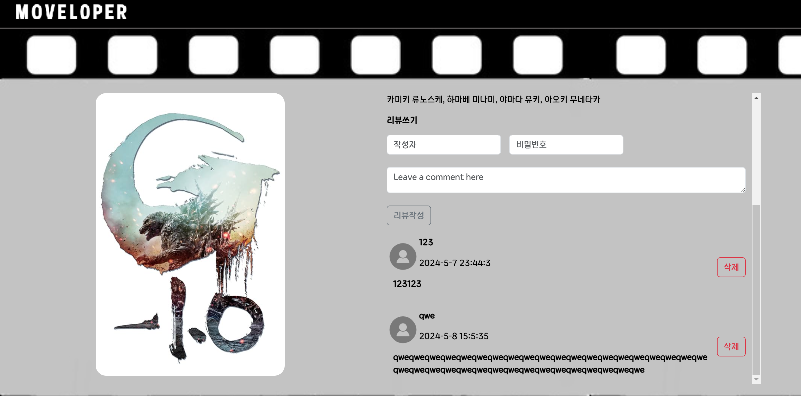

# 🖥️ 개발자되고파 팀의 내배캠 인기영화 콜렉션


## 프로젝트 소개
- 개인과제에서 작성한 [내배캠 인기영화 콜렉션]을 발전시키는 팀 프로젝트
- 팀원들의 프로젝트 N개 중 1개를 대표로 선택, 팀 프로젝트로 발전
- TMDB(KR) 오픈 API를 이용한 인기 영화 콜렉션
- GitHub-Page : https://jkc-mycode.github.io/Rank_Movie_Site/
- 시연 영상 : https://youtu.be/wpvDnRVjSoA

<br>

## 팀원 구성
- 팀장 : 김정찬 [@jkc-mycode](https://github.com/jkc-mycode)
- 팀원 : 조민수 [@CMINSOO](https://github.com/CMINSOO)
- 팀원 : 이동효 [@hyodong2](https://github.com/hyodong2)
- 팀원 : 윤동협 [@ydh1503](https://github.com/ydh1503)
- 팀원 : 신이지니 [@shinleejini](https://github.com/shinleejini)
- 팀원 : 서동현 [@lucetaseo](https://github.com/lucetaseo)

<br>

## 필수 구현 사항
- TMDB 또는 영화진흥위원회 오픈 API 이용 (O)

- 영화정보 상세 페이지 구현 (O)

- 상세 페이지 영화 리뷰 작성 기능 구현 (O)

- github PR(=Pull Request) 사용한 협업 (O)

- UX를 고려한 validation check (O)

- const와 let만을 이용한 변수 선언 (O)

- 화살표 함수 : 하기 예시 중 2개 이상 사용 (O)

- 반복문 : 하기 예시 전부 구현 (O)
  - [일반 for문](https://github.com/jkc-mycode/Rank_Movie_Site/blob/20a4f6ba48cee5d14270838480207f1149d6d133/src/movie.js#L116)
  - [for … of문](https://github.com/jkc-mycode/Rank_Movie_Site/blob/20a4f6ba48cee5d14270838480207f1149d6d133/src/movie.js#L21)
  - [일반 while문](https://github.com/jkc-mycode/Rank_Movie_Site/blob/20a4f6ba48cee5d14270838480207f1149d6d133/src/movie_slide.js#L49)
  - [break문](https://github.com/jkc-mycode/Rank_Movie_Site/blob/20a4f6ba48cee5d14270838480207f1149d6d133/src/movie_slide.js#L51)

- 배열(1) : 하기 예시 중 2개 이상 사용 (O)
  - [push](https://github.com/jkc-mycode/Rank_Movie_Site/blob/20a4f6ba48cee5d14270838480207f1149d6d133/src/detail.js#L22)
  - [splice](https://github.com/jkc-mycode/Rank_Movie_Site/blob/20a4f6ba48cee5d14270838480207f1149d6d133/src/review.js#L47)

- DOM 제어하기 : 하기 api 목록 중, 4개 이상 사용하기 (O)
  - [document.getElementById(id)](https://github.com/jkc-mycode/Rank_Movie_Site/blob/20a4f6ba48cee5d14270838480207f1149d6d133/src/genre_data.js#L129)
  - [document.querySelector(selector)](https://github.com/jkc-mycode/Rank_Movie_Site/blob/20a4f6ba48cee5d14270838480207f1149d6d133/src/detail.js#L113)
  - [document.querySelectorAll(selector)](https://github.com/jkc-mycode/Rank_Movie_Site/blob/20a4f6ba48cee5d14270838480207f1149d6d133/src/movie.js#L39)
  - [element.innerHTML](https://github.com/jkc-mycode/Rank_Movie_Site/blob/20a4f6ba48cee5d14270838480207f1149d6d133/src/detail.js#L54)
  - [element.addEventListener(type, listener)](https://github.com/jkc-mycode/Rank_Movie_Site/blob/20a4f6ba48cee5d14270838480207f1149d6d133/src/genre_data.js#L129)

- module (O)


<br>

## 1. 개발 기간
- 2024.05.01 ~ 2024.05.09

<br>

## 2. 개발 환경
- FrontEnd : HTML, CSS, JavaScript, Bootstrap
- API : [TMDB](https://developer.themoviedb.org/reference/intro/getting-started)

<br>

## 3. 역할 분배
- **김정찬**
  - 코드 병합
  - 팀원들의 기능 구현 도움
- **조민수**
  - 영화 상세 페이지 구현
  - 영화 상세 페이지 디자인
  - 시연 영상 촬영
- **이동효**
  - 영화 검색 기능 구현
- **윤동협**
  - 메인 슬라이드 구현
  - 영화 카드 슬라이드 구현
  - 메인 페이지 디자인
- **신이지니**
  - 카테고리 별 영화 검색 구현
  - 메인 페이지 디자인
- **서동현**
  - 리뷰 기능 구현
  - 발표자

<br>

## 4. 와이어 프레임



<br>

## 5. 주요 기능
### 5-1. 제목 검색 기능
- 원래 개인과제에서 구현되어야 할 기능임

- 검색 기능이 구현된 코드는 이미 모듈화되어 있어서 팀원들이 보기 불편함

- 그래서 기본 틀만 구성된 코드에서 프로젝트를 진행함

- 제목을 입력하고 검색 버튼을 클릭하면 해당 영화의 카드가 출력됨


- 그래고 제목을 입력하고 엔터를 누르면 마찬가지로 검색이 됨
```javascript
// 제목으로 검색하는 함수
async function executeSearch() {
    document.getElementById("movieCard").innerHTML = " ";
    document.getElementById("movie_slide").innerHTML = " ";
    document.getElementById("movieCard_wrapper").innerHTML = " ";

    const data = await getData();
    data.forEach(async function (item) {
        await makeCard(item);
    });

    const searchText = document.getElementById("searchInput").value.toLowerCase();
    const cards = document.querySelectorAll(".search_cards");

    // display 옵션을 통해서 보일지 숨길지 결정
    cards.forEach(function (card) {
        const title = card.querySelector(".card_title").textContent.toLowerCase();
        if (title.includes(searchText)) {
            card.style.display = "block";
        } else {
            card.style.display = "none";
        }
    });
}
```

<br>

### 5-2. 카테고리 별 검색 기능
- 제목 검색 외에도 카테고리(장르)를 기준으로 검색하는 기능도 구현함

- 영화 데이터에는 `genre` 라는 배열 데이터가 주어짐

- 드롭다운 박스를 통해서 장르를 선택하면 그 장르의 영화만 출력됨

- 장르를 선택하면 드롭다운 박스에 현재 선택한 카테고리(장르)가 보임



```javascript
// 장르 데이터를 불러와서 카드를 만드는 함수
const loadGenreData = (movieDataList, genreId, genreName) => {
    let searchedMovies = [];

    movieDataList.forEach(item => {
        if (item.genre_ids.includes(Number(genreId))) {
            searchedMovies.push(item)
        }
    });

    document.getElementById("movieCard").innerHTML = " ";
    document.getElementById("movie_slide").innerHTML = " ";
    document.getElementById("movieCard_wrapper").innerHTML = " ";

    searchedMovies.forEach(async item => {
        await makeCard(item);
    });

    document.querySelector("#dropdown_btn").innerText = genreName;
}
```


<br>

### 5-3. Top 10 영화 이미지 슬라이드 기능
- 현재 영화들 중 상위 10개 영화의 이미지를 슬라이드로 보여줌

- 각 영화마다 이미지를 `fetch` 를 통해 API에서 가져옴

- 각 영화의 이미지를 가져오는 작업을 동시에 진행가기 위해서 `Promise.all()` 를 사용


```javascript
// 각 영화의 이미지를 모아서 
const getImgData = async function () {
    const totalData = await getData();

    return await Promise.all(totalData.map(async (item) => (
        item.slide_poster_path = await matchImageById(item.id)
    )))
        .then(() => {
            return totalData;
        })
        .catch((error) => {
            // 오류 처리
            console.error("데이터를 가져오는 중 오류가 발생했습니다.", error);
        });
};


// 매개변수로 받은 id로 TMDB API에서 데이터 fetch하는 함수
const matchImageById = async function (id) {
    const response = await fetch("https://api.themoviedb.org/3/movie/" + id + "/images", options);
    const data = await response.json();

    return data.backdrops[0].file_path;
};
```


<br>

### 5-4. 영화 카드 슬라이드 기능
- 전체 영화를 좌우의 슬라이드 버튼으로 확인 가능

- 슬라이드는 처음과 끝이 연결된 루프 형태


- 코드가 길어서 자세한 코드는 깃허브 참조
```javascript
// 슬라이드 카드 만드는 함수
export async function makeSlideCard(item) {
    const innerContents = `
            <li class="card" id= "mvcard_${item.id}">
                <a href = "./detail.html?${item.id}">
                    
                </a>
            </li>
        `;

    $movieCards.insertAdjacentHTML("beforeend", innerContents);
}


// 슬라이드 카드 출력하는 함수
export async function print() {
    const data = await getData();
    let count = 0;
    Promise.all(
        data.map(async function (item) {
            await makeSlideCard(item);
            slideCount++;
        })
    ).then((res) => {
        $movieCardLi = document.querySelectorAll(".movieCards>li");
        makeClone();
    });

    // Next, Prev 버튼으로 카드 슬라이드 동작하는 이벤트 추가 (무한루프)
    $nextBtn.addEventListener("click", function () {
        moveCardSlide(currentIdx + 1);
        console.log($movieCardLi);
    });
    $prevBtn.addEventListener("click", function () {
        moveCardSlide(currentIdx - 1);
    });
}
```


<br>

### 5-5. 영화 상세 페이지 기능
- 메인 화면에서 영화 카드 클릭 시 영화 상세페이지로 이동


- 상세페이지에서는 영화의 상세정보, 출연진 정보, 트레일러 영상 정보를 가져옴

- 그래서 총 3개의 API를 사용함
```javascript
//  영화 감독 출연진 정보에 대한 api가져오기
async function getCredit(id) {
    const response = await fetch(`https://api.themoviedb.org/3/movie/${id}/credits?language=ko-KR`, options);
    const data = await response.json();
    console.log(data);

    const newMovieCredit = [];
    newMovieCredit.push(data.cast);
    newMovieCredit.push(data.crew);

    return newMovieCredit;
}


//  영화트레일러 api
async function getVideo(id) {
    const response = await fetch(`https://api.themoviedb.org/3/movie/${id}/videos?language=ko-KR`, options);
    const data = await response.json();
    console.log(data);
    let newVideo;
    newVideo = data.results;

    return newVideo;
}


// 영화디테일 api
async function getDetail(id) {
    const response = await fetch(`https://api.themoviedb.org/3/movie/${id}?language=ko-KR`, options);
    const data = await response.json();
    let newDetail;
    newDetail = data;

    return newDetail;
}
```


<br>

### 5-6. 영화 리뷰 기능
- 영화 리뷰 기능은 해당 영화 상세페이지에서 작성 가능

- 작성자, 비밀번호, 내용을 입력하고 버튼을 누르면 localStorage에 해당 댓글이 저장됨

- 영화 ID를 Key값으로 사용해서 데이터 저장




- 작성한 리뷰는 리뷰 작성란 밑으로 쌓이게 됨


```javascript
// 댓글 작성 함수
export function addComment() {
    let name = document.getElementById('reviewer').value;
    let password = document.getElementById('review_pass').value;
    let review = document.getElementById('review_content').value;
    let movieId = document.getElementById('movieId').value;

    // 현재 날짜 및 시간 가져오기
    let today = new Date();
    let date = today.getFullYear() + '-' + (today.getMonth() + 1) + '-' + today.getDate();
    let time = today.getHours() + ":" + today.getMinutes() + ":" + today.getSeconds();
    let dateTime = date + ' ' + time;

    let commentId = generateUniqueId(); // 댓글 고유 아이디 생성

    // 댓글을 로컬 스토리지에 저장
    let commentsKey = 'comments_' + window.location.href; // 페이지 URL을 키로 사용
    let comments = JSON.parse(localStorage.getItem(commentsKey)) || [];
    comments.push({ id: commentId, name: name, password: password, review: review, dateTime: dateTime, movieId: movieId });
    localStorage.setItem(commentsKey, JSON.stringify(comments));

    document.getElementById('reviewer').value = '';
    document.getElementById('review_pass').value = '';
    document.getElementById('review_content').value = '';
}
```


<br>

## 6. 페이지 사진 첨부


<br>

## 7. 어려웠던 점
### 7-1. 역할 분배의 어려움 (김정찬)
- 코드 구현이 어려운 팀원들도 있기 때문에 필수 기능 구현을 목표로 함
  
- 필수 기능을 우선으로 분배하는데, 인원 수 만큼 분배하기 어려웠음

- 그래서 대부분의 기능을 구현해본 팀장(김정찬)에게 따로 기능을 맡기지 않고 팀원들의 기능 구현에 도움을 주도록 함

- 가장 기억에 남은 도움은 동협님의 슬라이드 이미지 구현하는 코드임

- forEach문을 통해서 fetch를 반복해서 실행할 때 fetch 부분에 await를 걸어주면 끝이라고 생각했음

- 하지만 생각과는 다르게 forEach문 자체는 비동기적으로 동작했음

- 그래서 동협님과 계속 구글링하고 테스트해본 결과 Promise.all()을 통해서 반복적인 fetch를 비동기적으로 동시에 실행시켜서 해결했음

- 특히 Promise.all() 차체에도 await를 걸어서 Promise.all()은 동기적으로, 그 안의 fetch문들은 비동기적으로 실행시키는 게 핵심이었음

- 아직은 잘 설명하는 법을 익히지 못했지만 이렇게 팀원들의 질문을 받고 그 문제를 해결하는 과정 자체가 나의 기반을 다지는 과정이라고 생각함

<br>

### 7-2. 개발 능력이 뒤처져서 어려움을 겪음 (신이지니)
- 프로그래밍 노베이스로 시작을 했는데 갑자기 난이도가 확 올라간 느낌이라 진도를 하나도 따라가지 못해서 힘들었음
  
- 다행히 팀장님과 팀원들의 도움을 받아 하나하나 복습하며 내 파트를 구현할 수 있었음

<br>

### 7-3. 비동기 함수들의 실행 순서 문제 (윤동협)
- 데이터를 불러오기 이전에 데이터 처리 함수가 먼저 실행되는 오류가 발생하여 이를 처리하는데 많은 시간을 들였음
  
- 특히, 비동기 함수가 반복문에 들어가는 경우 해당 반복문이 끝난 이후에 데이터 처리 함수를 순차적으로 실행시키고 싶었으나 await를 통한 해결이 쉽지 않아 다른 방법을 모색해야 했음
  
- 예를들어 메인 슬라이드의 이미지의 경우, 이미 불러온 데이터 배열의 영화 id를 바탕으로 새 이미지를 fetch하여 기존 데이터 배열에 병합 후 n개를 추출하여 메인 슬라이드에 추가하는 방식으로 제작하였는데, 이 과정에서 새 이미지를 병합하기 전에 메인 슬라이드에 추가하는 함수가 먼저 동작하여 슬라이드에 이미지가 추가되지 않는 오류가 있었음

- 결과적으로 해당 오류는 Promise.all().then() 구문을 통해 해결할 수 있었다. Promise.all([promise1, promise2, ...])는 Promise의 배열을 받아 모든 Promise가 이행되는 것을 대기하는 메서드로써, 이 경우 Promise.all에 각 fetch를 반환하는 반복문을 넣어줌으로써 반복문 수행 이후 데이터 처리 함수가 순차적으로 진행되게끔 만들어줬음

- 이번 기회를 통해 async, await, Promise 등의 비동기 관련한 개념을 조금 더 확립할 수 있어 좋은 경험이 되었음

- 코드 링크 : https://github.com/jkc-mycode/Rank_Movie_Site/blob/dc77d6c6441c8c7932695cf87e1cdac4ce95abe0/src/movie_slide.js#L18-L31

<br>

### 7-4. Fetch를 통한 API 데이터 불러오는 어려움 (조민수)
- 이번 프로젝트를 통해 처음으로 API 를 Fetch 를 통해 원하는 데이터를 뽑아오는 경험을 하다보니 Fetch 함수를 생성하는부분이 가장 어려운 부분이 라고 생각함
 
- 하지만 한번 배워보고 직접 여러개의 api를 통해 데이터를 뽑아오다보니 익숙해져서 다행이라고 생각함

<br>

### 7-5. Git Branch 사용이 어려움 (서동현)
- git에서 계속 따로 분리되어서 브랜치 생성에 문제가 있었으며 그것을 행동하는데 어려움을 느낌

- url페이지마다 따로 적용을 해야하는 부분이 있었는데 url을 따로 잡는것에서 계속 잘 진행이 되지않아서 힘들었음

<br>

### 7-6. 검색 기능 구현에 대한 어려움 (이동효)
- 검색버튼을 이벤트 처리하는 부분에서 어려움을 겪음

- 자바스크립트 강의를 복습하며 코드작성을 함